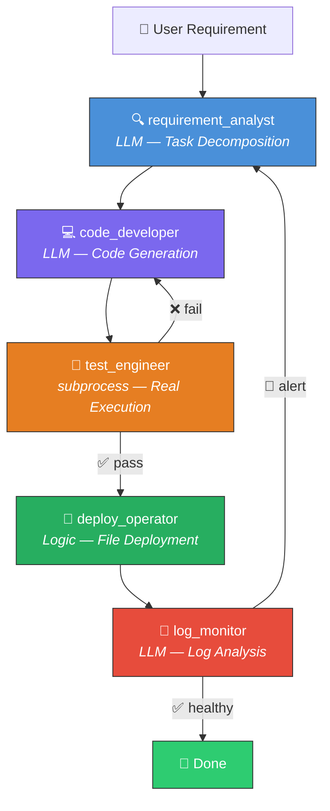

<div align="center">

# 🌙 Night Garden / 夜花园

**The Multi-Agent Framework for Quantitative Trading Development**

*Tell AI what you need. 5 Agents write, test, deploy & monitor your quant code automatically.*

[](LICENSE)
[](https://python.org)
[](https://github.com/langchain-ai/langgraph)
[](CONTRIBUTING.md)

[English](#-30-second-demo) | [中文文档](#-中文文档)

</div>

---

## 🎬 30-Second Demo

```
$ python main.py

============================================================
  Night Garden (夜花园)
  Multi-Agent Quant Code Development System
============================================================

请输入你的量化开发需求 / Enter your quant development requirement:
> 实现一个 BTC/USDT 双均线交叉策略，包含止损逻辑

------------------------------------------------------------
  [requirement_analyst] ✅ Task decomposed → ma_crossover_strategy.py
  [code_developer]      ✅ Code generated  → workspace/src/ma_crossover_strategy.py (156 lines)
  [code_developer]      ✅ Tests generated → workspace/tests/test_ma_crossover_strategy.py
  [test_engineer]       ✅ Tests PASSED (3/3)
  [deploy_operator]     ✅ Deployed → workspace/production/ma_crossover_strategy.py
  [log_monitor]         ✅ Healthy — no anomalies detected
------------------------------------------------------------

  ✨ Done! Your strategy code is ready at:
     workspace/production/ma_crossover_strategy.py
```

> **One sentence in, production-ready code out.** No manual coding needed.

---

## ✨ Features

- 🤖 **5 Specialized AI Agents** — each with a clear role in the dev pipeline, not generic chatbots
- 🔄 **Self-Healing Loop** — test failures auto-retry; production errors feed back for fixes
- ⚡ **Real Execution** — code is actually written to disk, tests actually run via `subprocess`
- 📂 **Configurable Workspace** — all outputs in your workspace, managed by `workspace.yaml`
- 🏦 **Quant-Native** — prompts and workflows optimized for trading strategies, risk management, data pipelines & backtesting
- 🔌 **Dual LLM Support** — switch between OpenAI and Anthropic with one env var
- 📊 **Full Audit Trail** — every agent action logged with structured messages

---

## 🏗️ Architecture



---

## 🤖 The 5 Agents

| # | Agent | Role | Mode | What It Does |
|---|-------|------|------|-------------|
| 1 | `requirement_analyst` | Analyst | LLM | Parses natural language requirements into structured task JSON |
| 2 | `code_developer` | Engineer | LLM | Generates Python code + pytest tests, writes to `workspace/src/` |
| 3 | `test_engineer` | QA | LLM + subprocess | Runs code & tests via `subprocess`, analyzes pass/fail |
| 4 | `deploy_operator` | DevOps | Logic | Copies approved code to `production/`, writes deploy logs |
| 5 | `log_monitor` | SRE | LLM | Monitors `production/logs/`, alerts loop back to step 1 |

---

## 🚀 Quick Start

### 1. Install

```bash
git clone https://github.com/coolerwu/night_graden.git
cd night_graden
pip install -r requirements.txt
```

### 2. Configure

```bash
cp .env.example .env
```

Edit `.env` with your API key:

```env
LLM_PROVIDER=openai          # or anthropic
LLM_MODEL=gpt-4o
OPENAI_API_KEY=sk-your-key
WORKSPACE_ROOT=./my_workspace
```

### 3. Run

**CLI mode:**
```bash
python main.py
```

**Web UI mode:**
```bash
python main.py --web
# Open http://localhost:8000 in your browser
```

Then type your requirement:

```
> Build a grid trading strategy for ETH/USDT with dynamic grid spacing
```

That's it. The agents handle the rest.

---

## 📂 Workspace System

All agent outputs live in **your workspace**, not inside the project. Configure via `workspace.yaml`:

```yaml
# {WORKSPACE_ROOT}/workspace.yaml
workspace_name: "my_quant_project"
code_output_dir: "./src"           # Where code_developer writes code
test_output_dir: "./tests"         # Where test_engineer puts results
deploy_dir: "./production"         # Where deploy_operator copies approved code
log_dir: "./production/logs"       # Where log_monitor reads logs
```

First run auto-creates the config and all directories.

```
my_workspace/
├── workspace.yaml          # Auto-generated config
├── src/                    # 💻 Generated code lands here
├── tests/                  # 🧪 Test files here
└── production/             # 🚀 Deployed code
    └── logs/               # 📡 Deploy & runtime logs
```

---

## 💡 Example Use Cases

| Requirement | What Gets Generated |
|-------------|-------------------|
| "实现 BTC/USDT 均线交叉策略" | Moving average crossover strategy with signal logic |
| "编写 Binance WebSocket 行情采集模块" | Real-time market data collector with reconnection |
| "实现最大回撤止损风控模块" | Drawdown-based risk manager with position sizing |
| "搭建历史数据回测框架" | Backtesting engine with performance metrics |
| "Build a momentum factor scoring system" | Multi-factor momentum scorer with ranking |

---

## 🆚 Why Night Garden?

| Feature | Night Garden | Manual Coding | ChatDev | MetaGPT |
|---------|:-----------:|:-------------:|:-------:|:-------:|
| Quant-specific agents | ✅ | - | ❌ | ❌ |
| Real code execution & testing | ✅ | ✅ | ❌ | ❌ |
| Self-healing feedback loop | ✅ | ❌ | ❌ | ❌ |
| Configurable workspace | ✅ | ✅ | ❌ | ❌ |
| One-line to production | ✅ | ❌ | ❌ | ❌ |
| Trading domain prompts | ✅ | - | ❌ | ❌ |

---

## 🛠️ Tech Stack

| Component | Technology |
|-----------|-----------|
| Agent Orchestration | [LangGraph](https://github.com/langchain-ai/langgraph) |
| LLM Providers | OpenAI GPT-4o / Anthropic Claude |
| Code Execution | Python `subprocess` |
| Testing | pytest |
| Workspace Config | YAML |
| State Management | TypedDict + LangGraph State |
| Web UI | FastAPI + Jinja2 + HTMX + Alpine.js |
| Real-time Streaming | SSE (Server-Sent Events) |

---

## 🗺️ Roadmap

- [x] 5-agent development pipeline (analyze → code → test → deploy → monitor)
- [x] Self-healing loop (test failure retry + alert feedback)
- [x] Configurable workspace with `workspace.yaml`
- [x] Dual LLM support (OpenAI / Anthropic)
- [x] Web UI for workspace management & agent monitoring
- [ ] ReAct mode for requirement_analyst (multi-step reasoning)
- [ ] Multi-file project generation (strategy + config + launcher)
- [ ] Backtesting integration (auto-run backtest after code generation)
- [ ] Strategy performance benchmarking
- [ ] Plugin system for custom agents

---

## 🤝 Contributing

Contributions are welcome! Here's how to get started:

1. Fork the repository
2. Create your feature branch (`git checkout -b feature/amazing-feature`)
3. Commit your changes (`git commit -m 'Add amazing feature'`)
4. Push to the branch (`git push origin feature/amazing-feature`)
5. Open a Pull Request

**Ideas for contribution:**
- New agent types (e.g., `backtester`, `optimizer`)
- More quant strategy templates
- Web UI / dashboard
- Additional LLM provider support
- Documentation & tutorials

---

## 📄 License

[MIT](LICENSE) — use it freely for personal and commercial projects.

---

<details>
<summary><h2>🇨🇳 中文文档</h2></summary>

### 项目简介

夜花园是一个面向量化交易的多智能体代码开发系统。你只需用一句话描述需求，5 个 AI Agent 会自动完成：

1. **需求分析师** (`requirement_analyst`) — 将你的需求拆解为结构化开发任务
2. **代码工程师** (`code_developer`) — 生成 Python 代码和测试，真实写入磁盘
3. **测试工程师** (`test_engineer`) — 用 subprocess 真实执行代码和 pytest
4. **运维部署** (`deploy_operator`) — 将通过测试的代码部署到 production 目录
5. **日志监控** (`log_monitor`) — 分析线上日志，发现异常自动反馈修复

### 核心特性

- 🔄 **自愈闭环** — 测试失败自动重试，线上异常自动反馈修复
- ⚡ **真实执行** — 代码真正写入磁盘，测试真正用 subprocess 运行
- 📂 **可配置 Workspace** — 所有产出物在用户指定的目录内，通过 `workspace.yaml` 管理
- 🏦 **量化原生** — 提示词和工作流专为交易策略、风控、数据采集、回测优化

### 快速开始

```bash
git clone https://github.com/coolerwu/night_graden.git
cd night_graden
pip install -r requirements.txt
cp .env.example .env   # 编辑填入 API Key
python main.py
```

输入示例：
- "实现一个 BTC/USDT 均线交叉策略"
- "编写 Binance WebSocket 行情采集模块"
- "实现回撤止损风控模块"
- "搭建历史数据回测框架"

### 项目结构

```
night_graden/                       # Agent 系统代码
├── agents/                         # 5 个核心 Agent
│   ├── base.py                     # BaseAgent (LLM 封装)
│   ├── requirement_analyst.py      # 需求分析师
│   ├── code_developer.py           # 代码工程师
│   ├── test_engineer.py            # 测试工程师
│   ├── deploy_operator.py          # 运维部署
│   └── log_monitor.py              # 日志监控
├── graph/                          # LangGraph 工作流编排
│   ├── state.py                    # WorkflowState 状态定义
│   └── workflow.py                 # StateGraph 构建 & 条件路由
├── config/                         # 配置
│   ├── settings.py                 # 环境变量
│   └── prompts.py                  # Agent 系统提示词
├── utils/                          # 工具
│   ├── logger.py                   # 统一日志
│   └── workspace.py                # Workspace 配置管理
└── main.py                         # CLI 入口
```

</details>

---

<div align="center">

**If Night Garden helps you, consider giving it a ⭐**

Built with 🌙 by [coolerwu](https://github.com/coolerwu)

</div>
